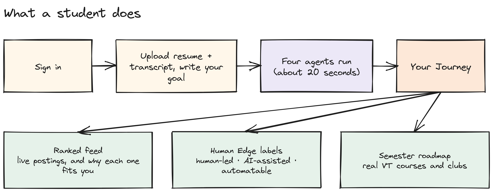
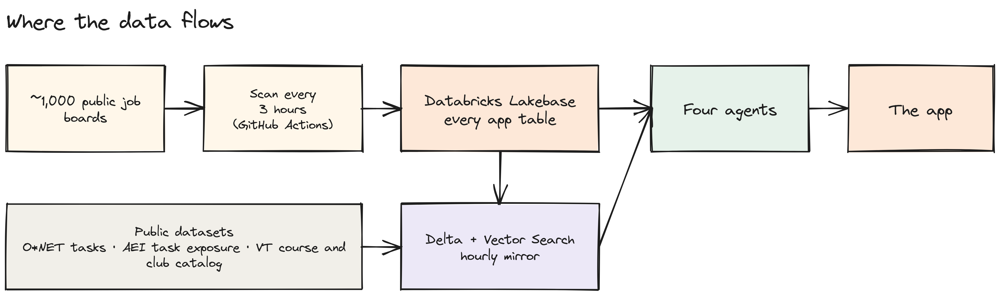
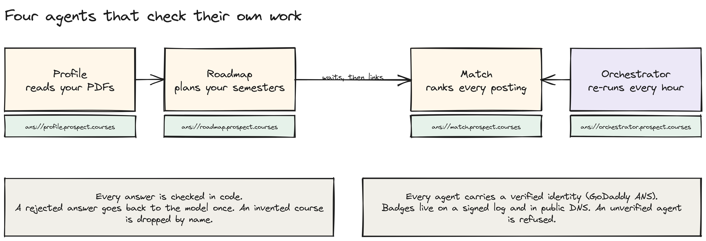

# Prospect

**The career journey for every Virginia Tech student, all majors.** Upload a resume and a transcript, write your goal in one sentence, and four agents build your journey: a live feed of open postings ranked for you, Human Edge labels on the duties of your top postings, and a semester roadmap of real VT courses and clubs.

**Live: https://prospect.courses** · Built at VTHacks 14, September 18 to 20, 2026.

## Try it in three minutes

1. Go to https://prospect.courses and create your own account with an email and password. No confirmation email, you are in right away.

2. Upload the mock student's [resume](datasets/mock-profile/mock-resume.pdf) and [transcript](datasets/mock-profile/mock-transcript.pdf), pick role types, a target term and your work authorization.
3. Write the goal in one short sentence, under 80 characters. Examples that work well:
   - `Land a management consulting internship at a Big 4 firm, Summer 2027`
   - `Technology consulting internship focused on data and AI strategy`
   - `Cybersecurity consultant internship, summer 2027`
4. Watch the five named steps run, about 20 seconds, and land on your Journey.

## How it works







Editable sources for each picture are in [`docs/diagrams/`](docs/diagrams/). Open a `.excalidraw` file at excalidraw.com.

## What you get

- **A live feed, ranked for you.** GitHub Actions scan about a thousand public company job boards every 30 minutes. Every role says in plain words why it fits, which requirements you meet, and which ones the posting never states. Apply opens the employer's real page and only logs it after you confirm.
- **Human Edge labels.** Your top postings are split into duties, each duty is matched to its nearest O*NET task, and each task is labeled Human-led, AI-assisted or Automatable from the Anthropic Economic Index. Unmeasured tasks say "not measured".
- **A semester roadmap.** Real VT courses and clubs from the catalog, projects marked "suggested", certifications with a source link. Mark steps done, add notes, re-plan later terms.

## Four agents that check their own work

| Agent | Job |
| --- | --- |
| **Profile** | reads the two PDFs into a structured profile |
| **Roadmap** | plans your semesters from the real VT catalog |
| **Match** | ranks every open US posting from the last 30 days, then waits for Roadmap and links postings to roadmap steps |
| **Orchestrator** | a Databricks Job that re-runs Match for every profile when new postings land |

- **Self-correction.** Every answer is validated in code. A rejected answer goes back to the model once with the exact reason, inside the same timeout. A second failure is a named error, never a silent fallback.
- **No invented courses.** A roadmap step that is not in the catalog is dropped and named in the step label. A plan whose every step is invalid fails loudly.
- **The model does not decide what matters.** Ranking is a printed function in code. Whether a requirement is "met" is decided in code against your profile. Every call runs at temperature 0 with a fixed seed, every structured call has a JSON schema, and job or PDF text is fenced as data, never as instructions.
- **Verified identity.** Each agent holds a GoDaddy ANS identity under `prospect.courses`, sealed on a signed Transparency Log, with badge, SVCB and TLSA records live in public DNS. With the gate on (`ANS_ENFORCE=1` against the Transparency Log), an agent whose badge is not ACTIVE is refused before it writes a row; production runs with the gate off because the log is local.

## Built with

| Layer | What |
| --- | --- |
| Data backend | **Databricks**: Lakebase (managed Postgres) holds every app table; an hourly Job mirrors it into Delta; Vector Search maps postings to career archetypes, duties to O*NET tasks, goals to courses and clubs; Genie answers "why" questions at script level |
| Agents | **Gemini** through one harness (`lib/agents/`) |
| Identity | **GoDaddy ANS** for the four agents (`ans/`) |
| App | Next.js 16, TypeScript, Vercel; email and password sign-in |
| Ingestion | GitHub Actions crons (`.github/workflows/`) |

Every merge was gated on `tsc`, `eslint`, 1,258 tests and a production build.

## For judges with their own agent

Server card: `https://prospect.courses/.well-known/mcp/server-card.json`. The bearer below is read-only (`whoami`, `plan_next_steps`); every owner tool refuses it by name.

```bash
curl -s https://prospect.courses/api/mcp \
  -H "Authorization: Bearer $MCP_JUDGE_SECRET" \
  -H "Content-Type: application/json" -H "Accept: application/json, text/event-stream" \
  -d '{"jsonrpc":"2.0","id":1,"method":"tools/call","params":{"name":"plan_next_steps","arguments":{"goal":"management consulting internship","limit":5}}}'
```

Full run of show, DNS lookups and the impostor refusal: [`docs/ANS-DEMO.md`](docs/ANS-DEMO.md). Technical brief: [`docs/ARCHITECTURE.md`](docs/ARCHITECTURE.md). Databricks walkthrough: [`databricks/DEMO.md`](databricks/DEMO.md).

## Repo map

```
app/          routes: landing, setup, journey, applications, settings, api/ (watcher, profile, match, MCP)
components/   UI
lib/          the logic: agents/, db.ts (Lakebase), catalog.ts, exposure.ts, ans-verify.ts
db/lakebase/  the schema, applied in order
databricks/   sync job, orchestrator job, archetypes, genie
ans/          agent registration, registry.json, dns-records.json
datasets/     every dataset we load, the scripts that built them, the mock student's PDFs
scripts/      scanners, loaders, smoke tests
tests/        1,258 tests
docs/         ARCHITECTURE.md, ANS-DEMO.md, diagrams/
```

## Run it locally

```bash
npm ci
cp .env.example .env.local                                    # Lakebase, auth, Gemini, route secrets
node --env-file=.env.local scripts/apply-schema.mjs           # db/lakebase/*.sql
node --env-file=.env.local scripts/load-lakebase-catalog.mjs  # datasets/ into Lakebase
npm run dev
```

## Data

[O*NET 31.0](https://www.onetcenter.org/) task statements (CC BY 4.0) · [Anthropic Economic Index](https://huggingface.co/datasets/Anthropic/EconomicIndex) task exposure · [catalog.vt.edu](https://catalog.vt.edu/) 2026-27 courses and majors · GobblerConnect club listings.
